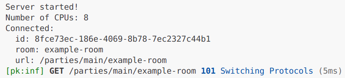

# 🎈 farmer-drive

This is the **React starter** which pairs a PartyKit server with a React client. I've created this as a proof-of-concept to demonstrate the broader Node.js API support with my proposed `nodejs-compat` plugin changes. It uses the `os` Node.js API, which is not available under the [current `nodejs-compat` plugin](https://github.com/partykit/partykit/blob/main/packages/partykit/src/nodejs-compat.ts).

## Usage

Run `npm run dev` and open [http://localhost:1999](http://localhost:1999) in your browser. Check the logs to see `Number of CPUs: <number>`. It should look like this:

